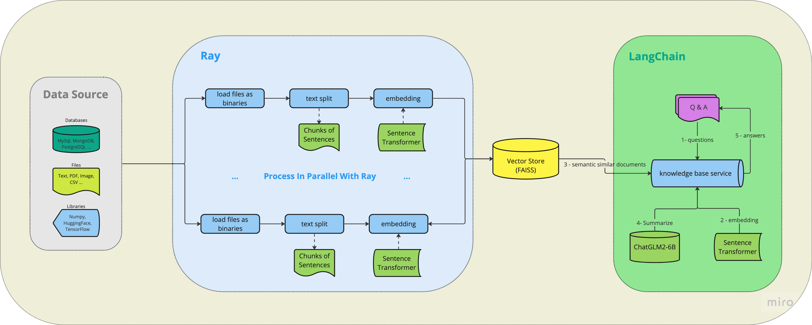

# (WIP)k8s-specific-knowledge-base

This is a Question-Answering system based on k8s-specific knowledge build on ChatGLM2-6B, serving by Ray.
It's not ready for production, but we'll target for this.

<!-- ## Quick Start -->

## Architecture

## 🤔 What we used ?

- [LangChain](https://github.com/langchain-ai/langchain)  to build LLM applications.
- [Ray](https://github.com/ray-project/ray) for accelerating and serving.
- [ChatGLM2-6B](https://github.com/THUDM/ChatGLM2-6B) as a base model.
- [multi-qa-mpnet-base-dot-v1](https://huggingface.co/sentence-transformers/multi-qa-mpnet-base-dot-v1) for embedding in semantic search.
- [FAISS](https://github.com/facebookresearch/faiss) as a vector database.

## 📦 Corpus Including

- Kubernetes Website
- Kubernetes Blogs
- Kubernetes Books (Only for research usage)

## 🔖 What's next ?

- Containerization, FAISS is for single node.
- More efficient text splitting ways designed for Chinese.
- More approaches to support semantic search, e.g. key-word embeddings.
- Raw data management, like new uploading and deleting.
- Vector data persistent.
- Continuous Pre-Training.
- and so on ...

## 📚 Reference

- [langchain-ray](https://github.com/ray-project/langchain-ray)
