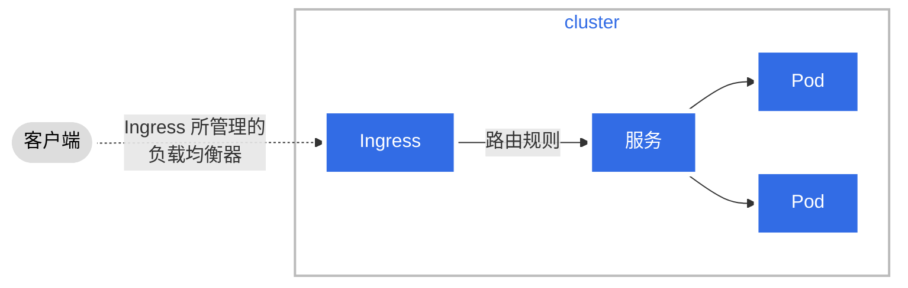

本指南为你展示如何创建、编辑和分享基于 Mermaid JavaScript 库的图表。
Mermaid.js 允许你使用简单的、类似于 Markdown 的语法来在 Markdown 文件中生成图表。
你也可以使用 Mermaid 来创建 `.svg` 或 `.png` 图片文件，将其添加到你的文档中。

本指南的目标受众是所有希望了解 Mermaid 的用户，以及那些想了解如何创建图表并将其添加到
Kubernetes 文档中的用户。

图 1 概要介绍的是本节所涉及的话题。


flowchart LR
subgraph m[Mermaid.js]
direction TB
S[ ]-.-
C[使用 markdown 来<br>构造图表] -->
D[在线<br>编辑器]
end
A[为什么图表<br>很有用] --> m
m --> N[3 种创建<br>图表的方法]
N --> T[示例]
T --> X[样式<br>与标题]
X --> V[提示]


    classDef box fill:#fff,stroke:#000,stroke-width:1px,color:#000;
    classDef spacewhite fill:#ffffff,stroke:#fff,stroke-width:0px,color:#000
    class A,C,D,N,X,m,T,V box
    class S spacewhite

%% you can hyperlink Mermaid diagram nodes to a URL using click statements

click A "https://mermaid-js.github.io/mermaid-live-editor/edit/#eyJjb2RlIjoiZmxvd2NoYXJ0IExSXG4gICAgc3ViZ3JhcGggbVtNZXJtYWlkLmpzXVxuICAgIGRpcmVjdGlvbiBUQlxuICAgICAgICBTWyBdLS4tXG4gICAgICAgIENbYnVpbGQ8YnI-ZGlhZ3JhbXM8YnI-d2l0aCBtYXJrZG93bl0gLS0-XG4gICAgICAgIERbb24tbGluZTxicj5saXZlIGVkaXRvcl1cbiAgICBlbmRcbiAgICBBW1doeSBhcmUgZGlhZ3JhbXM8YnI-dXNlZnVsP10gLS0-IG1cbiAgICBtIC0tPiBOWzMgeCBtZXRob2RzPGJyPmZvciBjcmVhdGluZzxicj5kaWFncmFtc11cbiAgICBOIC0tPiBUW0V4YW1wbGVzXVxuICAgIFQgLS0-IFhbU3R5bGluZzxicj5hbmQ8YnI-Y2FwdGlvbnNdXG4gICAgWCAtLT4gVltUaXBzXVxuICAgIFxuIFxuICAgIGNsYXNzRGVmIGJveCBmaWxsOiNmZmYsc3Ryb2tlOiMwMDAsc3Ryb2tlLXdpZHRoOjFweCxjb2xvcjojMDAwO1xuICAgIGNsYXNzRGVmIHNwYWNld2hpdGUgZmlsbDojZmZmZmZmLHN0cm9rZTojZmZmLHN0cm9rZS13aWR0aDowcHgsY29sb3I6IzAwMFxuICAgIGNsYXNzIEEsQyxELE4sWCxtLFQsViBib3hcbiAgICBjbGFzcyBTIHNwYWNld2hpdGUiLCJtZXJtYWlkIjoie1xuICBcInRoZW1lXCI6IFwiZGVmYXVsdFwiXG59IiwidXBkYXRlRWRpdG9yIjpmYWxzZSwiYXV0b1N5bmMiOnRydWUsInVwZGF0ZURpYWdyYW0iOnRydWV9" _blank
click C "https://mermaid-js.github.io/mermaid-live-editor/edit/#eyJjb2RlIjoiZmxvd2NoYXJ0IExSXG4gICAgc3ViZ3JhcGggbVtNZXJtYWlkLmpzXVxuICAgIGRpcmVjdGlvbiBUQlxuICAgICAgICBTWyBdLS4tXG4gICAgICAgIENbYnVpbGQ8YnI-ZGlhZ3JhbXM8YnI-d2l0aCBtYXJrZG93bl0gLS0-XG4gICAgICAgIERbb24tbGluZTxicj5saXZlIGVkaXRvcl1cbiAgICBlbmRcbiAgICBBW1doeSBhcmUgZGlhZ3JhbXM8YnI-dXNlZnVsP10gLS0-IG1cbiAgICBtIC0tPiBOWzMgeCBtZXRob2RzPGJyPmZvciBjcmVhdGluZzxicj5kaWFncmFtc11cbiAgICBOIC0tPiBUW0V4YW1wbGVzXVxuICAgIFQgLS0-IFhbU3R5bGluZzxicj5hbmQ8YnI-Y2FwdGlvbnNdXG4gICAgWCAtLT4gVltUaXBzXVxuICAgIFxuIFxuICAgIGNsYXNzRGVmIGJveCBmaWxsOiNmZmYsc3Ryb2tlOiMwMDAsc3Ryb2tlLXdpZHRoOjFweCxjb2xvcjojMDAwO1xuICAgIGNsYXNzRGVmIHNwYWNld2hpdGUgZmlsbDojZmZmZmZmLHN0cm9rZTojZmZmLHN0cm9rZS13aWR0aDowcHgsY29sb3I6IzAwMFxuICAgIGNsYXNzIEEsQyxELE4sWCxtLFQsViBib3hcbiAgICBjbGFzcyBTIHNwYWNld2hpdGUiLCJtZXJtYWlkIjoie1xuICBcInRoZW1lXCI6IFwiZGVmYXVsdFwiXG59IiwidXBkYXRlRWRpdG9yIjpmYWxzZSwiYXV0b1N5bmMiOnRydWUsInVwZGF0ZURpYWdyYW0iOnRydWV9" _blank
click D "https://mermaid-js.github.io/mermaid-live-editor/edit/#eyJjb2RlIjoiZmxvd2NoYXJ0IExSXG4gICAgc3ViZ3JhcGggbVtNZXJtYWlkLmpzXVxuICAgIGRpcmVjdGlvbiBUQlxuICAgICAgICBTWyBdLS4tXG4gICAgICAgIENbYnVpbGQ8YnI-ZGlhZ3JhbXM8YnI-d2l0aCBtYXJrZG93bl0gLS0-XG4gICAgICAgIERbb24tbGluZTxicj5saXZlIGVkaXRvcl1cbiAgICBlbmRcbiAgICBBW1doeSBhcmUgZGlhZ3JhbXM8YnI-dXNlZnVsP10gLS0-IG1cbiAgICBtIC0tPiBOWzMgeCBtZXRob2RzPGJyPmZvciBjcmVhdGluZzxicj5kaWFncmFtc11cbiAgICBOIC0tPiBUW0V4YW1wbGVzXVxuICAgIFQgLS0-IFhbU3R5bGluZzxicj5hbmQ8YnI-Y2FwdGlvbnNdXG4gICAgWCAtLT4gVltUaXBzXVxuICAgIFxuIFxuICAgIGNsYXNzRGVmIGJveCBmaWxsOiNmZmYsc3Ryb2tlOiMwMDAsc3Ryb2tlLXdpZHRoOjFweCxjb2xvcjojMDAwO1xuICAgIGNsYXNzRGVmIHNwYWNld2hpdGUgZmlsbDojZmZmZmZmLHN0cm9rZTojZmZmLHN0cm9rZS13aWR0aDowcHgsY29sb3I6IzAwMFxuICAgIGNsYXNzIEEsQyxELE4sWCxtLFQsViBib3hcbiAgICBjbGFzcyBTIHNwYWNld2hpdGUiLCJtZXJtYWlkIjoie1xuICBcInRoZW1lXCI6IFwiZGVmYXVsdFwiXG59IiwidXBkYXRlRWRpdG9yIjpmYWxzZSwiYXV0b1N5bmMiOnRydWUsInVwZGF0ZURpYWdyYW0iOnRydWV9" _blank
click N "https://mermaid-js.github.io/mermaid-live-editor/edit/#eyJjb2RlIjoiZmxvd2NoYXJ0IExSXG4gICAgc3ViZ3JhcGggbVtNZXJtYWlkLmpzXVxuICAgIGRpcmVjdGlvbiBUQlxuICAgICAgICBTWyBdLS4tXG4gICAgICAgIENbYnVpbGQ8YnI-ZGlhZ3JhbXM8YnI-d2l0aCBtYXJrZG93bl0gLS0-XG4gICAgICAgIERbb24tbGluZTxicj5saXZlIGVkaXRvcl1cbiAgICBlbmRcbiAgICBBW1doeSBhcmUgZGlhZ3JhbXM8YnI-dXNlZnVsP10gLS0-IG1cbiAgICBtIC0tPiBOWzMgeCBtZXRob2RzPGJyPmZvciBjcmVhdGluZzxicj5kaWFncmFtc11cbiAgICBOIC0tPiBUW0V4YW1wbGVzXVxuICAgIFQgLS0-IFhbU3R5bGluZzxicj5hbmQ8YnI-Y2FwdGlvbnNdXG4gICAgWCAtLT4gVltUaXBzXVxuICAgIFxuIFxuICAgIGNsYXNzRGVmIGJveCBmaWxsOiNmZmYsc3Ryb2tlOiMwMDAsc3Ryb2tlLXdpZHRoOjFweCxjb2xvcjojMDAwO1xuICAgIGNsYXNzRGVmIHNwYWNld2hpdGUgZmlsbDojZmZmZmZmLHN0cm9rZTojZmZmLHN0cm9rZS13aWR0aDowcHgsY29sb3I6IzAwMFxuICAgIGNsYXNzIEEsQyxELE4sWCxtLFQsViBib3hcbiAgICBjbGFzcyBTIHNwYWNld2hpdGUiLCJtZXJtYWlkIjoie1xuICBcInRoZW1lXCI6IFwiZGVmYXVsdFwiXG59IiwidXBkYXRlRWRpdG9yIjpmYWxzZSwiYXV0b1N5bmMiOnRydWUsInVwZGF0ZURpYWdyYW0iOnRydWV9" _blank
click T "https://mermaid-js.github.io/mermaid-live-editor/edit/#eyJjb2RlIjoiZmxvd2NoYXJ0IExSXG4gICAgc3ViZ3JhcGggbVtNZXJtYWlkLmpzXVxuICAgIGRpcmVjdGlvbiBUQlxuICAgICAgICBTWyBdLS4tXG4gICAgICAgIENbYnVpbGQ8YnI-ZGlhZ3JhbXM8YnI-d2l0aCBtYXJrZG93bl0gLS0-XG4gICAgICAgIERbb24tbGluZTxicj5saXZlIGVkaXRvcl1cbiAgICBlbmRcbiAgICBBW1doeSBhcmUgZGlhZ3JhbXM8YnI-dXNlZnVsP10gLS0-IG1cbiAgICBtIC0tPiBOWzMgeCBtZXRob2RzPGJyPmZvciBjcmVhdGluZzxicj5kaWFncmFtc11cbiAgICBOIC0tPiBUW0V4YW1wbGVzXVxuICAgIFQgLS0-IFhbU3R5bGluZzxicj5hbmQ8YnI-Y2FwdGlvbnNdXG4gICAgWCAtLT4gVltUaXBzXVxuICAgIFxuIFxuICAgIGNsYXNzRGVmIGJveCBmaWxsOiNmZmYsc3Ryb2tlOiMwMDAsc3Ryb2tlLXdpZHRoOjFweCxjb2xvcjojMDAwO1xuICAgIGNsYXNzRGVmIHNwYWNld2hpdGUgZmlsbDojZmZmZmZmLHN0cm9rZTojZmZmLHN0cm9rZS13aWR0aDowcHgsY29sb3I6IzAwMFxuICAgIGNsYXNzIEEsQyxELE4sWCxtLFQsViBib3hcbiAgICBjbGFzcyBTIHNwYWNld2hpdGUiLCJtZXJtYWlkIjoie1xuICBcInRoZW1lXCI6IFwiZGVmYXVsdFwiXG59IiwidXBkYXRlRWRpdG9yIjpmYWxzZSwiYXV0b1N5bmMiOnRydWUsInVwZGF0ZURpYWdyYW0iOnRydWV9" _blank
click X "https://mermaid-js.github.io/mermaid-live-editor/edit/#eyJjb2RlIjoiZmxvd2NoYXJ0IExSXG4gICAgc3ViZ3JhcGggbVtNZXJtYWlkLmpzXVxuICAgIGRpcmVjdGlvbiBUQlxuICAgICAgICBTWyBdLS4tXG4gICAgICAgIENbYnVpbGQ8YnI-ZGlhZ3JhbXM8YnI-d2l0aCBtYXJrZG93bl0gLS0-XG4gICAgICAgIERbb24tbGluZTxicj5saXZlIGVkaXRvcl1cbiAgICBlbmRcbiAgICBBW1doeSBhcmUgZGlhZ3JhbXM8YnI-dXNlZnVsP10gLS0-IG1cbiAgICBtIC0tPiBOWzMgeCBtZXRob2RzPGJyPmZvciBjcmVhdGluZzxicj5kaWFncmFtc11cbiAgICBOIC0tPiBUW0V4YW1wbGVzXVxuICAgIFQgLS0-IFhbU3R5bGluZzxicj5hbmQ8YnI-Y2FwdGlvbnNdXG4gICAgWCAtLT4gVltUaXBzXVxuICAgIFxuIFxuICAgIGNsYXNzRGVmIGJveCBmaWxsOiNmZmYsc3Ryb2tlOiMwMDAsc3Ryb2tlLXdpZHRoOjFweCxjb2xvcjojMDAwO1xuICAgIGNsYXNzRGVmIHNwYWNld2hpdGUgZmlsbDojZmZmZmZmLHN0cm9rZTojZmZmLHN0cm9rZS13aWR0aDowcHgsY29sb3I6IzAwMFxuICAgIGNsYXNzIEEsQyxELE4sWCxtLFQsViBib3hcbiAgICBjbGFzcyBTIHNwYWNld2hpdGUiLCJtZXJtYWlkIjoie1xuICBcInRoZW1lXCI6IFwiZGVmYXVsdFwiXG59IiwidXBkYXRlRWRpdG9yIjpmYWxzZSwiYXV0b1N5bmMiOnRydWUsInVwZGF0ZURpYWdyYW0iOnRydWV9" _blank
click V "https://mermaid-js.github.io/mermaid-live-editor/edit/#eyJjb2RlIjoiZmxvd2NoYXJ0IExSXG4gICAgc3ViZ3JhcGggbVtNZXJtYWlkLmpzXVxuICAgIGRpcmVjdGlvbiBUQlxuICAgICAgICBTWyBdLS4tXG4gICAgICAgIENbYnVpbGQ8YnI-ZGlhZ3JhbXM8YnI-d2l0aCBtYXJrZG93bl0gLS0-XG4gICAgICAgIERbb24tbGluZTxicj5saXZlIGVkaXRvcl1cbiAgICBlbmRcbiAgICBBW1doeSBhcmUgZGlhZ3JhbXM8YnI-dXNlZnVsP10gLS0-IG1cbiAgICBtIC0tPiBOWzMgeCBtZXRob2RzPGJyPmZvciBjcmVhdGluZzxicj5kaWFncmFtc11cbiAgICBOIC0tPiBUW0V4YW1wbGVzXVxuICAgIFQgLS0-IFhbU3R5bGluZzxicj5hbmQ8YnI-Y2FwdGlvbnNdXG4gICAgWCAtLT4gVltUaXBzXVxuICAgIFxuIFxuICAgIGNsYXNzRGVmIGJveCBmaWxsOiNmZmYsc3Ryb2tlOiMwMDAsc3Ryb2tlLXdpZHRoOjFweCxjb2xvcjojMDAwO1xuICAgIGNsYXNzRGVmIHNwYWNld2hpdGUgZmlsbDojZmZmZmZmLHN0cm9rZTojZmZmLHN0cm9rZS13aWR0aDowcHgsY29sb3I6IzAwMFxuICAgIGNsYXNzIEEsQyxELE4sWCxtLFQsViBib3hcbiAgICBjbGFzcyBTIHNwYWNld2hpdGUiLCJtZXJtYWlkIjoie1xuICBcInRoZW1lXCI6IFwiZGVmYXVsdFwiXG59IiwidXBkYXRlRWRpdG9yIjpmYWxzZSwiYXV0b1N5bmMiOnRydWUsInVwZGF0ZURpYWdyYW0iOnRydWV9" _blank



图 1. 本节中涉及的话题。

开始使用 Mermaid 之前，你需要以下准备：

* 对 Markdown 有一个基本的了解
* 使用 Mermaid 在线编辑器
* 使用 [Hugo 短代码（shortcode）](/zh-cn/docs/contribute/style/hugo-shortcodes/)
* 使用 [Hugo  短代码](https://gohugo.io/content-management/shortcodes/#figure)
* 执行 [Hugo 本地预览](/zh-cn/docs/contribute/new-content/open-a-pr/#preview-locally)
* 熟悉[贡献新内容](/zh-cn/docs/contribute/new-content/)的流程


你可以点击本节中的每个图表来查看其源代码，以及在 Mermaid 在线编辑器中渲染的图表结果。



## 你为什么应该在代码中使用图表 {#why-you-should-use-diagram-in-documentation}

图表可以增进文档的清晰度，便于理解。对于用户和贡献者而言都有好处。

用户获得的好处有：
* __较为友好的初次体验__：非常详尽的、只包含文本的欢迎页面对用户而言是蛮恐怖的，
  尤其是初次接触 Kubernetes 的用户。
* __快速理解概念__：图表可以帮助用户理解复杂主题下的要点。
  你的图表可以作为一种可视化的学习指南，将用户带入主题的细节。
* __便于记忆__：对某些人而言，图形（图像）要比文字更容易记忆。

对贡献者而言的好处有：

* __帮助确立所贡献文档的结构和内容__。例如，
  你可以先提供一个覆盖所有顶层要点的图表，然后再逐步展开细节。
* __培养用户社区并提升其能力__。容易理解的文档，附以图表，能够吸引新的用户，
  尤其是那些因为预见到复杂性而不愿参与的用户。

你需要考虑你的目标受众。除了一些有经验的 Kubernetes 用户外，你还会遇到很多刚接触
Kubernetes 的用户。即使一张简单的图表也可以帮助新用户吸收 Kubernetes 概念。
他们会变得更为大胆和自信，进一步地了解 Kubernetes 及其文档。

## Mermaid

[Mermaid](https://mermaid-js.github.io/mermaid/#/) 是一个开源的 JavaScript 库，
可以帮助你创建、编辑并很容易地分享图表。这些图表使用简单的、类似 Markdown
的语法开发，并可内嵌到 Markdown 文件中。

下面是 Mermaid 的一些特性：

* 简单的编码语法
* 包含基于 Web 的工具，便于你编制和预览你的图表
* 支持包括流程图、状态图、时序图在内的多种格式
* 可以通过共享图表的 URL 来与同事方便地合作
* 有丰富的形状、线条、主题和样式可供选择

使用 Mermaid 的一些好处如下：

* 不需要使用另外的、非 Mermaid 的图表工具
* 与现有的 PR 工作流结合的很好。你可以将 Mermaid 代码视为你的 PR 中所包含的
  Markdown 文本
* 简单的工具生成简单的图表。你不需要精心制作或雕琢过于复杂或详尽的图片。
  保持简单就好。

Mermaid 提供一种简单的、开放且透明的方法，便于 SIG 社区为新的或现有的文档添加、
编辑图表并展开协作。


即使你的工作环境中不支持，你仍然可以使用 Mermaid 来创建、编辑图表。
这种方法称作 __Mermaid+SVG__，在后文详细解释。


### 在线编辑器

[Mermaid 在线编辑器](https://mermaid-js.github.io/mermaid-live-editor)是一个基于
Web 的工具，允许你创建、编辑和审阅图表。

在线编辑器的功能主要有：

* 显示 Mermaid 代码和渲染的图表。
* 为所保存的每个图表生成一个 URL。该 URL 显示在你的浏览器的 URL 字段中。
  你可以将 URL 分享给同事，便于他人访问和更改图表。
* 提供将图表下载为 `.svg` 或 `.png` 文件的选项。



在线编辑器是创建和编辑 Mermaid 图表的最简单的，也是最快的方式。


## 创建图表的方法   {#methods-for-creating-diagrams}

图 2 给出三种生成和添加图表的方法。


graph TB
A[贡献者]
B[向 .md 文件<br><br>中内嵌<br>Mermaid 代码]
C[Mermaid+SVG<br><br>将 Mermaid 所生成的<br>SVG 文件添加到 .md 文件]
D[外部工具<br><br>添加外部工具<br>所生成的 SVG<br>文件到 .md 文件]

    A --> B
    A --> C
    A --> D

    classDef box fill:#fff,stroke:#000,stroke-width:1px,color:#000;
    class A,B,C,D box

%% 你可以使用 click 语句为 Mermaid 节点设置指向某 URL 的超链接

click A "https://mermaid-js.github.io/mermaid-live-editor/edit/#eyJjb2RlIjoiZ3JhcGggVEJcbiAgICBBW0NvbnRyaWJ1dG9yXVxuICAgIEJbSW5saW5lPGJyPjxicj5NZXJtYWlkIGNvZGU8YnI-YWRkZWQgdG8gLm1kIGZpbGVdXG4gICAgQ1tNZXJtYWlkK1NWRzxicj48YnI-QWRkIG1lcm1haWQtZ2VuZXJhdGVkPGJyPnN2ZyBmaWxlIHRvIC5tZCBmaWxlXVxuICAgIERbRXh0ZXJuYWwgdG9vbDxicj48YnI-QWRkIGV4dGVybmFsLXRvb2wtPGJyPmdlbmVyYXRlZCBzdmcgZmlsZTxicj50byAubWQgZmlsZV1cblxuICAgIEEgLS0-IEJcbiAgICBBIC0tPiBDXG4gICAgQSAtLT4gRFxuXG4gICAgY2xhc3NEZWYgYm94IGZpbGw6I2ZmZixzdHJva2U6IzAwMCxzdHJva2Utd2lkdGg6MXB4LGNvbG9yOiMwMDA7XG4gICAgY2xhc3MgQSxCLEMsRCBib3giLCJtZXJtYWlkIjoie1xuICBcInRoZW1lXCI6IFwiZGVmYXVsdFwiXG59IiwidXBkYXRlRWRpdG9yIjpmYWxzZSwiYXV0b1N5bmMiOnRydWUsInVwZGF0ZURpYWdyYW0iOmZhbHNlfQ" _blank

click B "https://mermaid-js.github.io/mermaid-live-editor/edit/#eyJjb2RlIjoiZ3JhcGggVEJcbiAgICBBW0NvbnRyaWJ1dG9yXVxuICAgIEJbSW5saW5lPGJyPjxicj5NZXJtYWlkIGNvZGU8YnI-YWRkZWQgdG8gLm1kIGZpbGVdXG4gICAgQ1tNZXJtYWlkK1NWRzxicj48YnI-QWRkIG1lcm1haWQtZ2VuZXJhdGVkPGJyPnN2ZyBmaWxlIHRvIC5tZCBmaWxlXVxuICAgIERbRXh0ZXJuYWwgdG9vbDxicj48YnI-QWRkIGV4dGVybmFsLXRvb2wtPGJyPmdlbmVyYXRlZCBzdmcgZmlsZTxicj50byAubWQgZmlsZV1cblxuICAgIEEgLS0-IEJcbiAgICBBIC0tPiBDXG4gICAgQSAtLT4gRFxuXG4gICAgY2xhc3NEZWYgYm94IGZpbGw6I2ZmZixzdHJva2U6IzAwMCxzdHJva2Utd2lkdGg6MXB4LGNvbG9yOiMwMDA7XG4gICAgY2xhc3MgQSxCLEMsRCBib3giLCJtZXJtYWlkIjoie1xuICBcInRoZW1lXCI6IFwiZGVmYXVsdFwiXG59IiwidXBkYXRlRWRpdG9yIjpmYWxzZSwiYXV0b1N5bmMiOnRydWUsInVwZGF0ZURpYWdyYW0iOmZhbHNlfQ" _blank

click C "https://mermaid-js.github.io/mermaid-live-editor/edit/#eyJjb2RlIjoiZ3JhcGggVEJcbiAgICBBW0NvbnRyaWJ1dG9yXVxuICAgIEJbSW5saW5lPGJyPjxicj5NZXJtYWlkIGNvZGU8YnI-YWRkZWQgdG8gLm1kIGZpbGVdXG4gICAgQ1tNZXJtYWlkK1NWRzxicj48YnI-QWRkIG1lcm1haWQtZ2VuZXJhdGVkPGJyPnN2ZyBmaWxlIHRvIC5tZCBmaWxlXVxuICAgIERbRXh0ZXJuYWwgdG9vbDxicj48YnI-QWRkIGV4dGVybmFsLXRvb2wtPGJyPmdlbmVyYXRlZCBzdmcgZmlsZTxicj50byAubWQgZmlsZV1cblxuICAgIEEgLS0-IEJcbiAgICBBIC0tPiBDXG4gICAgQSAtLT4gRFxuXG4gICAgY2xhc3NEZWYgYm94IGZpbGw6I2ZmZixzdHJva2U6IzAwMCxzdHJva2Utd2lkdGg6MXB4LGNvbG9yOiMwMDA7XG4gICAgY2xhc3MgQSxCLEMsRCBib3giLCJtZXJtYWlkIjoie1xuICBcInRoZW1lXCI6IFwiZGVmYXVsdFwiXG59IiwidXBkYXRlRWRpdG9yIjpmYWxzZSwiYXV0b1N5bmMiOnRydWUsInVwZGF0ZURpYWdyYW0iOmZhbHNlfQ" _blank

click D "https://mermaid-js.github.io/mermaid-live-editor/edit/#eyJjb2RlIjoiZ3JhcGggVEJcbiAgICBBW0NvbnRyaWJ1dG9yXVxuICAgIEJbSW5saW5lPGJyPjxicj5NZXJtYWlkIGNvZGU8YnI-YWRkZWQgdG8gLm1kIGZpbGVdXG4gICAgQ1tNZXJtYWlkK1NWRzxicj48YnI-QWRkIG1lcm1haWQtZ2VuZXJhdGVkPGJyPnN2ZyBmaWxlIHRvIC5tZCBmaWxlXVxuICAgIERbRXh0ZXJuYWwgdG9vbDxicj48YnI-QWRkIGV4dGVybmFsLXRvb2wtPGJyPmdlbmVyYXRlZCBzdmcgZmlsZTxicj50byAubWQgZmlsZV1cblxuICAgIEEgLS0-IEJcbiAgICBBIC0tPiBDXG4gICAgQSAtLT4gRFxuXG4gICAgY2xhc3NEZWYgYm94IGZpbGw6I2ZmZixzdHJva2U6IzAwMCxzdHJva2Utd2lkdGg6MXB4LGNvbG9yOiMwMDA7XG4gICAgY2xhc3MgQSxCLEMsRCBib3giLCJtZXJtYWlkIjoie1xuICBcInRoZW1lXCI6IFwiZGVmYXVsdFwiXG59IiwidXBkYXRlRWRpdG9yIjpmYWxzZSwiYXV0b1N5bmMiOnRydWUsInVwZGF0ZURpYWdyYW0iOmZhbHNlfQ" _blank

 

图 2. 创建图表的方法

### 内嵌（Inline）

图 3 给出的是使用内嵌方法来添加图表所遵循的步骤。


graph LR
A[1. 使用在线编辑器<br>来创建或编辑<br>图表] -->
B[2. 将图表的 URL<br>保存到某处] -->
C[3. 将 Mermaid 代码<br>复制到 markdown 文件中] -->
D[4. 添加图表标题]


    classDef box fill:#fff,stroke:#000,stroke-width:1px,color:#000;
    class A,B,C,D box

%% 你可以使用 click 语句为 Mermaid 节点设置指向某 URL 的超链接

click A "https://mermaid-js.github.io/mermaid-live-editor/edit/#eyJjb2RlIjoiZ3JhcGggTFJcbiAgICBBWzEuIFVzZSBsaXZlIGVkaXRvcjxicj4gdG8gY3JlYXRlL2VkaXQ8YnI-ZGlhZ3JhbV0gLS0-XG4gICAgQlsyLiBTdG9yZSBkaWFncmFtPGJyPlVSTCBzb21ld2hlcmVdIC0tPlxuICAgIENbMy4gQ29weSBNZXJtYWlkIGNvZGU8YnI-dG8gcGFnZSBtYXJrZG93biBmaWxlXSAtLT5cbiAgICBEWzQuIEFkZCBjYXB0aW9uXVxuIFxuXG4gICAgY2xhc3NEZWYgYm94IGZpbGw6I2ZmZixzdHJva2U6IzAwMCxzdHJva2Utd2lkdGg6MXB4LGNvbG9yOiMwMDA7XG4gICAgY2xhc3MgQSxCLEMsRCBib3hcbiAgICAiLCJtZXJtYWlkIjoie1xuICBcInRoZW1lXCI6IFwiZGVmYXVsdFwiXG59IiwidXBkYXRlRWRpdG9yIjpmYWxzZSwiYXV0b1N5bmMiOnRydWUsInVwZGF0ZURpYWdyYW0iOmZhbHNlfQ" _blank

click B "https://mermaid-js.github.io/mermaid-live-editor/edit/#eyJjb2RlIjoiZ3JhcGggTFJcbiAgICBBWzEuIFVzZSBsaXZlIGVkaXRvcjxicj4gdG8gY3JlYXRlL2VkaXQ8YnI-ZGlhZ3JhbV0gLS0-XG4gICAgQlsyLiBTdG9yZSBkaWFncmFtPGJyPlVSTCBzb21ld2hlcmVdIC0tPlxuICAgIENbMy4gQ29weSBNZXJtYWlkIGNvZGU8YnI-dG8gcGFnZSBtYXJrZG93biBmaWxlXSAtLT5cbiAgICBEWzQuIEFkZCBjYXB0aW9uXVxuIFxuXG4gICAgY2xhc3NEZWYgYm94IGZpbGw6I2ZmZixzdHJva2U6IzAwMCxzdHJva2Utd2lkdGg6MXB4LGNvbG9yOiMwMDA7XG4gICAgY2xhc3MgQSxCLEMsRCBib3hcbiAgICAiLCJtZXJtYWlkIjoie1xuICBcInRoZW1lXCI6IFwiZGVmYXVsdFwiXG59IiwidXBkYXRlRWRpdG9yIjpmYWxzZSwiYXV0b1N5bmMiOnRydWUsInVwZGF0ZURpYWdyYW0iOmZhbHNlfQ" _blank

click C "https://mermaid-js.github.io/mermaid-live-editor/edit/#eyJjb2RlIjoiZ3JhcGggTFJcbiAgICBBWzEuIFVzZSBsaXZlIGVkaXRvcjxicj4gdG8gY3JlYXRlL2VkaXQ8YnI-ZGlhZ3JhbV0gLS0-XG4gICAgQlsyLiBTdG9yZSBkaWFncmFtPGJyPlVSTCBzb21ld2hlcmVdIC0tPlxuICAgIENbMy4gQ29weSBNZXJtYWlkIGNvZGU8YnI-dG8gcGFnZSBtYXJrZG93biBmaWxlXSAtLT5cbiAgICBEWzQuIEFkZCBjYXB0aW9uXVxuIFxuXG4gICAgY2xhc3NEZWYgYm94IGZpbGw6I2ZmZixzdHJva2U6IzAwMCxzdHJva2Utd2lkdGg6MXB4LGNvbG9yOiMwMDA7XG4gICAgY2xhc3MgQSxCLEMsRCBib3hcbiAgICAiLCJtZXJtYWlkIjoie1xuICBcInRoZW1lXCI6IFwiZGVmYXVsdFwiXG59IiwidXBkYXRlRWRpdG9yIjpmYWxzZSwiYXV0b1N5bmMiOnRydWUsInVwZGF0ZURpYWdyYW0iOmZhbHNlfQ" _blank

click D "https://mermaid-js.github.io/mermaid-live-editor/edit/#eyJjb2RlIjoiZ3JhcGggTFJcbiAgICBBWzEuIFVzZSBsaXZlIGVkaXRvcjxicj4gdG8gY3JlYXRlL2VkaXQ8YnI-ZGlhZ3JhbV0gLS0-XG4gICAgQlsyLiBTdG9yZSBkaWFncmFtPGJyPlVSTCBzb21ld2hlcmVdIC0tPlxuICAgIENbMy4gQ29weSBNZXJtYWlkIGNvZGU8YnI-dG8gcGFnZSBtYXJrZG93biBmaWxlXSAtLT5cbiAgICBEWzQuIEFkZCBjYXB0aW9uXVxuIFxuXG4gICAgY2xhc3NEZWYgYm94IGZpbGw6I2ZmZixzdHJva2U6IzAwMCxzdHJva2Utd2lkdGg6MXB4LGNvbG9yOiMwMDA7XG4gICAgY2xhc3MgQSxCLEMsRCBib3hcbiAgICAiLCJtZXJtYWlkIjoie1xuICBcInRoZW1lXCI6IFwiZGVmYXVsdFwiXG59IiwidXBkYXRlRWRpdG9yIjpmYWxzZSwiYXV0b1N5bmMiOnRydWUsInVwZGF0ZURpYWdyYW0iOmZhbHNlfQ" _blank



图 3. 内嵌方法的步骤

下面是使用内嵌方法来添加图表时你要执行的步骤：

1. 使用在线编辑器创建你的图表
1. 将图表的 URL 保存在某处以便以后访问
1. 将 Mermaid 代码复制到你的 `.md` 文件中你希望它出现的位置
1. 使用 Markdown 文本在图表下方为其添加标题

Hugo 在构造（网站）过程中会运行 Mermaid 代码，将其转换为图表。


你可能认为记录图表 URL 是一个麻烦的过程。如果确实如此，你可以在 `.md` 文件中作一个记录，
标明该 Mermaid 代码是自说明的。贡献者可以将 Mermaid 代码复制到在线编辑器中编辑，
或者将其从在线编辑器中复制出来。


下面是一段包含在某 `.md` 文件中的示例代码片段：

```
---
title: 我的文档
---
图 17 给出从 A 到 B 的一个简单流程。
这里是其他 markdown 文本
...
 
    graph TB
    A --> B


图 17. 从 A 到 B

其他文本
```


你必须在 Mermaid 代码块之前和之后分别添加 Hugo Mermaid
短代码标记，而且你应该在图表之后为其添加图表标题。


有关添加图表标题的细节，参阅[如何使用标题](#how-to-use-captions)。

使用内嵌方法的好处有：

* 可以直接使用在线编辑器工具
* 很容易在在线编辑器与你的 `.md` 文件之间来回复制 Mermaid 代码
* 不需要额外处理 `.svg` 图片文件
* 内容文字、图表代码和图表标题都位于同一个 `.md` 文件中。

你应该使用[本地](/zh-cn/docs/contribute/new-content/open-a-pr/#preview-locally)和 Netlify
预览来验证图表是可以正常渲染的。


Mermaid 在线编辑器的功能特性可能不支持 K8s 网站的 Mermaid 特性。
你可能在 Hugo 构建过程中看到语法错误提示或者空白屏幕。
如果发生这类情况，可以考虑使用 Mermaid+SVG 方法。


### Mermaid+SVG

图 4 给出的是使用 Mermaid+SVG 方法添加图表所要遵循的步骤：


flowchart LR
A[1. 使用在线编辑器<br>创建或编辑<br>图表]
B[2. 将图表的 URL<br>保存到别处]
C[3. 生成 .svg 文件<br>并将其下载到<br>images/ 目录]
subgraph w[ ]
direction TB
D[4. 使用 figure 短代码<br>来在 .md 文件中<br>引用 .svg 文件] -->
E[5. 添加图表标题]
end
A --> B
B --> C
C --> w

    classDef box fill:#fff,stroke:#000,stroke-width:1px,color:#000;
    class A,B,C,D,E,w box

click A "https://mermaid-js.github.io/mermaid-live-editor/edit/#eyJjb2RlIjoiZmxvd2NoYXJ0IExSXG4gICAgQVsxLiBVc2UgbGl2ZSBlZGl0b3I8YnI-IHRvIGNyZWF0ZS9lZGl0PGJyPmRpYWdyYW1dXG4gICAgQlsyLiBTdG9yZSBkaWFncmFtPGJyPlVSTCBzb21ld2hlcmVdXG4gICAgQ1szLiBHZW5lcmF0ZSAuc3ZnIGZpbGU8YnI-YW5kIGRvd25sb2FkIHRvPGJyPmltYWdlcy8gZm9sZGVyXVxuICAgIHN1YmdyYXBoIHdbIF1cbiAgICBkaXJlY3Rpb24gVEJcbiAgICBEWzQuIFVzZSBmaWd1cmUgc2hvcnRjb2RlPGJyPnRvIHJlZmVyZW5jZSAuc3ZnPGJyPmZpbGUgaW4gcGFnZTxicj4ubWQgZmlsZV0gLS0-XG4gICAgRVs1LiBBZGQgY2FwdGlvbl1cbiAgICBlbmRcbkEgLS0-IEJcbkIgLS0-IENcbkMgLS0-IHdcblxuICAgIGNsYXNzRGVmIGJveCBmaWxsOiNmZmYsc3Ryb2tlOiMwMDAsc3Ryb2tlLXdpZHRoOjFweCxjb2xvcjojMDAwO1xuICAgIGNsYXNzIEEsQixDLEQsRSx3IGJveFxuICAgICIsIm1lcm1haWQiOiJ7XG4gIFwidGhlbWVcIjogXCJkZWZhdWx0XCJcbn0iLCJ1cGRhdGVFZGl0b3IiOmZhbHNlLCJhdXRvU3luYyI6dHJ1ZSwidXBkYXRlRGlhZ3JhbSI6dHJ1ZX0" _blank

click B "https://mermaid-js.github.io/mermaid-live-editor/edit/#eyJjb2RlIjoiZmxvd2NoYXJ0IExSXG4gICAgQVsxLiBVc2UgbGl2ZSBlZGl0b3I8YnI-IHRvIGNyZWF0ZS9lZGl0PGJyPmRpYWdyYW1dXG4gICAgQlsyLiBTdG9yZSBkaWFncmFtPGJyPlVSTCBzb21ld2hlcmVdXG4gICAgQ1szLiBHZW5lcmF0ZSAuc3ZnIGZpbGU8YnI-YW5kIGRvd25sb2FkIHRvPGJyPmltYWdlcy8gZm9sZGVyXVxuICAgIHN1YmdyYXBoIHdbIF1cbiAgICBkaXJlY3Rpb24gVEJcbiAgICBEWzQuIFVzZSBmaWd1cmUgc2hvcnRjb2RlPGJyPnRvIHJlZmVyZW5jZSAuc3ZnPGJyPmZpbGUgaW4gcGFnZTxicj4ubWQgZmlsZV0gLS0-XG4gICAgRVs1LiBBZGQgY2FwdGlvbl1cbiAgICBlbmRcbkEgLS0-IEJcbkIgLS0-IENcbkMgLS0-IHdcblxuICAgIGNsYXNzRGVmIGJveCBmaWxsOiNmZmYsc3Ryb2tlOiMwMDAsc3Ryb2tlLXdpZHRoOjFweCxjb2xvcjojMDAwO1xuICAgIGNsYXNzIEEsQixDLEQsRSx3IGJveFxuICAgICIsIm1lcm1haWQiOiJ7XG4gIFwidGhlbWVcIjogXCJkZWZhdWx0XCJcbn0iLCJ1cGRhdGVFZGl0b3IiOmZhbHNlLCJhdXRvU3luYyI6dHJ1ZSwidXBkYXRlRGlhZ3JhbSI6dHJ1ZX0" _blank

click C "https://mermaid-js.github.io/mermaid-live-editor/edit/#eyJjb2RlIjoiZmxvd2NoYXJ0IExSXG4gICAgQVsxLiBVc2UgbGl2ZSBlZGl0b3I8YnI-IHRvIGNyZWF0ZS9lZGl0PGJyPmRpYWdyYW1dXG4gICAgQlsyLiBTdG9yZSBkaWFncmFtPGJyPlVSTCBzb21ld2hlcmVdXG4gICAgQ1szLiBHZW5lcmF0ZSAuc3ZnIGZpbGU8YnI-YW5kIGRvd25sb2FkIHRvPGJyPmltYWdlcy8gZm9sZGVyXVxuICAgIHN1YmdyYXBoIHdbIF1cbiAgICBkaXJlY3Rpb24gVEJcbiAgICBEWzQuIFVzZSBmaWd1cmUgc2hvcnRjb2RlPGJyPnRvIHJlZmVyZW5jZSAuc3ZnPGJyPmZpbGUgaW4gcGFnZTxicj4ubWQgZmlsZV0gLS0-XG4gICAgRVs1LiBBZGQgY2FwdGlvbl1cbiAgICBlbmRcbkEgLS0-IEJcbkIgLS0-IENcbkMgLS0-IHdcblxuICAgIGNsYXNzRGVmIGJveCBmaWxsOiNmZmYsc3Ryb2tlOiMwMDAsc3Ryb2tlLXdpZHRoOjFweCxjb2xvcjojMDAwO1xuICAgIGNsYXNzIEEsQixDLEQsRSx3IGJveFxuICAgICIsIm1lcm1haWQiOiJ7XG4gIFwidGhlbWVcIjogXCJkZWZhdWx0XCJcbn0iLCJ1cGRhdGVFZGl0b3IiOmZhbHNlLCJhdXRvU3luYyI6dHJ1ZSwidXBkYXRlRGlhZ3JhbSI6dHJ1ZX0" _blank

click D "https://mermaid-js.github.io/mermaid-live-editor/edit/#eyJjb2RlIjoiZmxvd2NoYXJ0IExSXG4gICAgQVsxLiBVc2UgbGl2ZSBlZGl0b3I8YnI-IHRvIGNyZWF0ZS9lZGl0PGJyPmRpYWdyYW1dXG4gICAgQlsyLiBTdG9yZSBkaWFncmFtPGJyPlVSTCBzb21ld2hlcmVdXG4gICAgQ1szLiBHZW5lcmF0ZSAuc3ZnIGZpbGU8YnI-YW5kIGRvd25sb2FkIHRvPGJyPmltYWdlcy8gZm9sZGVyXVxuICAgIHN1YmdyYXBoIHdbIF1cbiAgICBkaXJlY3Rpb24gVEJcbiAgICBEWzQuIFVzZSBmaWd1cmUgc2hvcnRjb2RlPGJyPnRvIHJlZmVyZW5jZSAuc3ZnPGJyPmZpbGUgaW4gcGFnZTxicj4ubWQgZmlsZV0gLS0-XG4gICAgRVs1LiBBZGQgY2FwdGlvbl1cbiAgICBlbmRcbkEgLS0-IEJcbkIgLS0-IENcbkMgLS0-IHdcblxuICAgIGNsYXNzRGVmIGJveCBmaWxsOiNmZmYsc3Ryb2tlOiMwMDAsc3Ryb2tlLXdpZHRoOjFweCxjb2xvcjojMDAwO1xuICAgIGNsYXNzIEEsQixDLEQsRSx3IGJveFxuICAgICIsIm1lcm1haWQiOiJ7XG4gIFwidGhlbWVcIjogXCJkZWZhdWx0XCJcbn0iLCJ1cGRhdGVFZGl0b3IiOmZhbHNlLCJhdXRvU3luYyI6dHJ1ZSwidXBkYXRlRGlhZ3JhbSI6dHJ1ZX0" _blank

click E "https://mermaid-js.github.io/mermaid-live-editor/edit/#eyJjb2RlIjoiZmxvd2NoYXJ0IExSXG4gICAgQVsxLiBVc2UgbGl2ZSBlZGl0b3I8YnI-IHRvIGNyZWF0ZS9lZGl0PGJyPmRpYWdyYW1dXG4gICAgQlsyLiBTdG9yZSBkaWFncmFtPGJyPlVSTCBzb21ld2hlcmVdXG4gICAgQ1szLiBHZW5lcmF0ZSAuc3ZnIGZpbGU8YnI-YW5kIGRvd25sb2FkIHRvPGJyPmltYWdlcy8gZm9sZGVyXVxuICAgIHN1YmdyYXBoIHdbIF1cbiAgICBkaXJlY3Rpb24gVEJcbiAgICBEWzQuIFVzZSBmaWd1cmUgc2hvcnRjb2RlPGJyPnRvIHJlZmVyZW5jZSAuc3ZnPGJyPmZpbGUgaW4gcGFnZTxicj4ubWQgZmlsZV0gLS0-XG4gICAgRVs1LiBBZGQgY2FwdGlvbl1cbiAgICBlbmRcbkEgLS0-IEJcbkIgLS0-IENcbkMgLS0-IHdcblxuICAgIGNsYXNzRGVmIGJveCBmaWxsOiNmZmYsc3Ryb2tlOiMwMDAsc3Ryb2tlLXdpZHRoOjFweCxjb2xvcjojMDAwO1xuICAgIGNsYXNzIEEsQixDLEQsRSx3IGJveFxuICAgICIsIm1lcm1haWQiOiJ7XG4gIFwidGhlbWVcIjogXCJkZWZhdWx0XCJcbn0iLCJ1cGRhdGVFZGl0b3IiOmZhbHNlLCJhdXRvU3luYyI6dHJ1ZSwidXBkYXRlRGlhZ3JhbSI6dHJ1ZX0" _blank




图 4. Mermaid+SVG 方法的步骤。

使用 Mermaid+SVG 方法来添加图表时你要遵从的步骤：

1. 使用在线编辑器创建你的图表
1. 将图表的 URL 保存到某处以便以后访问
1. 为你的图表生成 `.svg` 文件，并将其下载到合适的 `images/` 目录下
1. 使用 `` 短代码在 `.md` 文件中引用该图表
1. 使用 `` 短代码的 `caption` 参数为图表设置标题

例如，使用在线编辑器创建一个名为 `boxnet` 的图表。
将图表的 URL 保存到别处以便以后访问。生成 `boxnet.svg` 文件并将其下载到合适的
`../images/` 目录下。

在你的 PR 中的 `.md` 文件内使用 `` 短代码来引用
`.svg` 图片文件，并为之添加标题。

```json

```

关于图表标题的细节，可参阅[如何使用标题](#how-to-use-captions)。


使用 `` 短代码是向你的文档中添加 `.svg` 图片文件的优选方法。
你也可以使用标准的 markdown 图片语法，即
``。
如果是后面这种，则需要在图表下面为其添加标题。


你应该使用文本编辑器以注释块的形式在 `.svg` 图片文件中添加在线编辑器的 URL。
例如，你应该在 `.svg` 图片文件的开头部分包含下面的内容：

```
```

使用 Mermaid+SVG 方法的好处有：

* 可以直接使用在线编辑器工具
* 在线编辑器支持的 Mermaid 特性集合最新
* 可以利用 K8s 网站用来处理 `.svg` 图片文件的现有方法
* 工作环境不需要 Mermaid 支持

要使用[本地](/zh-cn/docs/contribute/new-content/open-a-pr/#preview-locally)和
Netlify 预览来检查你的图表可以正常渲染。

### 外部工具

图 5 给出使用外部工具来添加图表时所遵循的步骤。

首先，要使用你的外部工具来创建图表，并将其保存为一个 `.svg` 文件或 `.png` 图片文件。
之后，使用 __Mermaid+SVG__ 方法中相同的步骤添加 `.svg`（`.png`）文件。


flowchart LR

A[1. 使用外部工具<br>来创建或编辑<br>图表]
B[2. 如果可能保存<br>图表位置供<br> 其他贡献者访问]
C[3. 生成 .svg 文件<br>或 .png 文件<br>并将其下载到<br>合适的 images/ 目录]

subgraph w[ ]
direction TB
D[4. 使用 figure 短代码<br>在你的 .md 文件中<br>引用该 SVG 或 PNG<br>文件] -->
E[5. 为图表添加标题]
end
A --> B
B --> C
C --> w

    classDef box fill:#fff,stroke:#000,stroke-width:1px,color:#000;
    class A,B,C,D,E,w box

click A "https://mermaid-js.github.io/mermaid-live-editor/edit/#eyJjb2RlIjoiZmxvd2NoYXJ0IExSXG4gICAgQVsxLiBVc2UgZXh0ZXJuYWw8YnI-dG9vbCB0byBjcmVhdGUvZWRpdDxicj5kaWFncmFtXVxuICAgIEJbMi4gSWYgcG9zc2libGUsIHNhdmU8YnI-ZGlhZ3JhbSBjb29yZGluYXRlczxicj5mb3IgY29udHJpYnV0b3I8YnI-YWNjZXNzXVxuICAgIENbMy4gR2VuZXJhdGUgLnN2ZyA8YnI-b3IucG5nIGZpbGU8YnI-YW5kIGRvd25sb2FkIHRvPGJyPmFwcHJvcHJpYXRlPGJyPmltYWdlcy8gZm9sZGVyXVxuICAgIHN1YmdyYXBoIHdbIF1cbiAgICBkaXJlY3Rpb24gVEJcbiAgICBEWzQuIFVzZSBmaWd1cmUgc2hvcnRjb2RlPGJyPnRvIHJlZmVyZW5jZSBzdmcgb3I8YnI-cG5nIGZpbGUgaW48YnI-cGFnZSAubWQgZmlsZV0gLS0-XG4gICAgRVs1LiBBZGQgY2FwdGlvbl1cbiAgICBlbmRcbiAgICBBIC0tPiBCXG4gICAgQiAtLT4gQ1xuICAgIEMgLS0-IHdcbiAgICBjbGFzc0RlZiBib3ggZmlsbDojZmZmLHN0cm9rZTojMDAwLHN0cm9rZS13aWR0aDoxcHgsY29sb3I6IzAwMDtcbiAgICBjbGFzcyBBLEIsQyxELEUsdyBib3hcbiAgICAiLCJtZXJtYWlkIjoie1xuICBcInRoZW1lXCI6IFwiZGVmYXVsdFwiXG59IiwidXBkYXRlRWRpdG9yIjpmYWxzZSwiYXV0b1N5bmMiOnRydWUsInVwZGF0ZURpYWdyYW0iOmZhbHNlfQ"

click B "https://mermaid-js.github.io/mermaid-live-editor/edit/#eyJjb2RlIjoiZmxvd2NoYXJ0IExSXG4gICAgQVsxLiBVc2UgZXh0ZXJuYWw8YnI-dG9vbCB0byBjcmVhdGUvZWRpdDxicj5kaWFncmFtXVxuICAgIEJbMi4gSWYgcG9zc2libGUsIHNhdmU8YnI-ZGlhZ3JhbSBjb29yZGluYXRlczxicj5mb3IgY29udHJpYnV0b3I8YnI-YWNjZXNzXVxuICAgIENbMy4gR2VuZXJhdGUgLnN2ZyA8YnI-b3IucG5nIGZpbGU8YnI-YW5kIGRvd25sb2FkIHRvPGJyPmFwcHJvcHJpYXRlPGJyPmltYWdlcy8gZm9sZGVyXVxuICAgIHN1YmdyYXBoIHdbIF1cbiAgICBkaXJlY3Rpb24gVEJcbiAgICBEWzQuIFVzZSBmaWd1cmUgc2hvcnRjb2RlPGJyPnRvIHJlZmVyZW5jZSBzdmcgb3I8YnI-cG5nIGZpbGUgaW48YnI-cGFnZSAubWQgZmlsZV0gLS0-XG4gICAgRVs1LiBBZGQgY2FwdGlvbl1cbiAgICBlbmRcbiAgICBBIC0tPiBCXG4gICAgQiAtLT4gQ1xuICAgIEMgLS0-IHdcbiAgICBjbGFzc0RlZiBib3ggZmlsbDojZmZmLHN0cm9rZTojMDAwLHN0cm9rZS13aWR0aDoxcHgsY29sb3I6IzAwMDtcbiAgICBjbGFzcyBBLEIsQyxELEUsdyBib3hcbiAgICAiLCJtZXJtYWlkIjoie1xuICBcInRoZW1lXCI6IFwiZGVmYXVsdFwiXG59IiwidXBkYXRlRWRpdG9yIjpmYWxzZSwiYXV0b1N5bmMiOnRydWUsInVwZGF0ZURpYWdyYW0iOmZhbHNlfQ"

click C "https://mermaid-js.github.io/mermaid-live-editor/edit/#eyJjb2RlIjoiZmxvd2NoYXJ0IExSXG4gICAgQVsxLiBVc2UgZXh0ZXJuYWw8YnI-dG9vbCB0byBjcmVhdGUvZWRpdDxicj5kaWFncmFtXVxuICAgIEJbMi4gSWYgcG9zc2libGUsIHNhdmU8YnI-ZGlhZ3JhbSBjb29yZGluYXRlczxicj5mb3IgY29udHJpYnV0b3I8YnI-YWNjZXNzXVxuICAgIENbMy4gR2VuZXJhdGUgLnN2ZyA8YnI-b3IucG5nIGZpbGU8YnI-YW5kIGRvd25sb2FkIHRvPGJyPmFwcHJvcHJpYXRlPGJyPmltYWdlcy8gZm9sZGVyXVxuICAgIHN1YmdyYXBoIHdbIF1cbiAgICBkaXJlY3Rpb24gVEJcbiAgICBEWzQuIFVzZSBmaWd1cmUgc2hvcnRjb2RlPGJyPnRvIHJlZmVyZW5jZSBzdmcgb3I8YnI-cG5nIGZpbGUgaW48YnI-cGFnZSAubWQgZmlsZV0gLS0-XG4gICAgRVs1LiBBZGQgY2FwdGlvbl1cbiAgICBlbmRcbiAgICBBIC0tPiBCXG4gICAgQiAtLT4gQ1xuICAgIEMgLS0-IHdcbiAgICBjbGFzc0RlZiBib3ggZmlsbDojZmZmLHN0cm9rZTojMDAwLHN0cm9rZS13aWR0aDoxcHgsY29sb3I6IzAwMDtcbiAgICBjbGFzcyBBLEIsQyxELEUsdyBib3hcbiAgICAiLCJtZXJtYWlkIjoie1xuICBcInRoZW1lXCI6IFwiZGVmYXVsdFwiXG59IiwidXBkYXRlRWRpdG9yIjpmYWxzZSwiYXV0b1N5bmMiOnRydWUsInVwZGF0ZURpYWdyYW0iOmZhbHNlfQ"

click D "https://mermaid-js.github.io/mermaid-live-editor/edit/#eyJjb2RlIjoiZmxvd2NoYXJ0IExSXG4gICAgQVsxLiBVc2UgZXh0ZXJuYWw8YnI-dG9vbCB0byBjcmVhdGUvZWRpdDxicj5kaWFncmFtXVxuICAgIEJbMi4gSWYgcG9zc2libGUsIHNhdmU8YnI-ZGlhZ3JhbSBjb29yZGluYXRlczxicj5mb3IgY29udHJpYnV0b3I8YnI-YWNjZXNzXVxuICAgIENbMy4gR2VuZXJhdGUgLnN2ZyA8YnI-b3IucG5nIGZpbGU8YnI-YW5kIGRvd25sb2FkIHRvPGJyPmFwcHJvcHJpYXRlPGJyPmltYWdlcy8gZm9sZGVyXVxuICAgIHN1YmdyYXBoIHdbIF1cbiAgICBkaXJlY3Rpb24gVEJcbiAgICBEWzQuIFVzZSBmaWd1cmUgc2hvcnRjb2RlPGJyPnRvIHJlZmVyZW5jZSBzdmcgb3I8YnI-cG5nIGZpbGUgaW48YnI-cGFnZSAubWQgZmlsZV0gLS0-XG4gICAgRVs1LiBBZGQgY2FwdGlvbl1cbiAgICBlbmRcbiAgICBBIC0tPiBCXG4gICAgQiAtLT4gQ1xuICAgIEMgLS0-IHdcbiAgICBjbGFzc0RlZiBib3ggZmlsbDojZmZmLHN0cm9rZTojMDAwLHN0cm9rZS13aWR0aDoxcHgsY29sb3I6IzAwMDtcbiAgICBjbGFzcyBBLEIsQyxELEUsdyBib3hcbiAgICAiLCJtZXJtYWlkIjoie1xuICBcInRoZW1lXCI6IFwiZGVmYXVsdFwiXG59IiwidXBkYXRlRWRpdG9yIjpmYWxzZSwiYXV0b1N5bmMiOnRydWUsInVwZGF0ZURpYWdyYW0iOmZhbHNlfQ"

click E "https://mermaid-js.github.io/mermaid-live-editor/edit/#eyJjb2RlIjoiZmxvd2NoYXJ0IExSXG4gICAgQVsxLiBVc2UgZXh0ZXJuYWw8YnI-dG9vbCB0byBjcmVhdGUvZWRpdDxicj5kaWFncmFtXVxuICAgIEJbMi4gSWYgcG9zc2libGUsIHNhdmU8YnI-ZGlhZ3JhbSBjb29yZGluYXRlczxicj5mb3IgY29udHJpYnV0b3I8YnI-YWNjZXNzXVxuICAgIENbMy4gR2VuZXJhdGUgLnN2ZyA8YnI-b3IucG5nIGZpbGU8YnI-YW5kIGRvd25sb2FkIHRvPGJyPmFwcHJvcHJpYXRlPGJyPmltYWdlcy8gZm9sZGVyXVxuICAgIHN1YmdyYXBoIHdbIF1cbiAgICBkaXJlY3Rpb24gVEJcbiAgICBEWzQuIFVzZSBmaWd1cmUgc2hvcnRjb2RlPGJyPnRvIHJlZmVyZW5jZSBzdmcgb3I8YnI-cG5nIGZpbGUgaW48YnI-cGFnZSAubWQgZmlsZV0gLS0-XG4gICAgRVs1LiBBZGQgY2FwdGlvbl1cbiAgICBlbmRcbiAgICBBIC0tPiBCXG4gICAgQiAtLT4gQ1xuICAgIEMgLS0-IHdcbiAgICBjbGFzc0RlZiBib3ggZmlsbDojZmZmLHN0cm9rZTojMDAwLHN0cm9rZS13aWR0aDoxcHgsY29sb3I6IzAwMDtcbiAgICBjbGFzcyBBLEIsQyxELEUsdyBib3hcbiAgICAiLCJtZXJtYWlkIjoie1xuICBcInRoZW1lXCI6IFwiZGVmYXVsdFwiXG59IiwidXBkYXRlRWRpdG9yIjpmYWxzZSwiYXV0b1N5bmMiOnRydWUsInVwZGF0ZURpYWdyYW0iOmZhbHNlfQ"




图 5. 外部工具方法步骤.

使用外部工具方法来添加图表时，你要遵从的步骤如下：

1. 使用你的外部工具来创建图表。
1. 将图表的位置保存起来供其他贡献者访问。例如，你的工具可能提供一个指向图表的链接，
   或者你可以将源码文件（例如一个 `.xml` 文件）放置到一个公开的仓库，
   以便其他贡献者访问。
1. 生成图表并将其下载为 `.svg` 或 `.png` 图片文件，保存到合适的 `../images/` 目录下。
1. 使用 `` 短代码从 `.md` 文件中引用该图表。
5. 使用 `` 短代码的 `caption` 参数为图表设置标题。

下面是一个用于 `images/apple.svg` 图表的 `` 短代码：

```text
 
```

如果你的外部绘图工具支持：

* 你可以将多个 `.svg` 或 `.png` 商标、图标或图片整合到你的图表中。
  不过，你需要确保你查看了版权并遵守了 Kubernetes 文档关于使用第三方内容的
  [指南](/zh-cn/docs/contribute/style/content-guide/)。
* 你应该将图表的源位置保存起来，以便其他贡献者访问。
  例如，你的工具可能提供指向图表文件的链接，或者你应该将源代码文件
  （例如一个 `.xml` 文件）放到某处以便其他贡献者访问。

关于 K8s 和 CNCF 商标与图片的详细信息，可参阅 [CNCF Artwork](https://github.com/cncf/artwork)。

使用外部工具的好处有：

* 贡献者对外部工具更为熟悉
* 图表可能需要 Mermaid 所无法提供的细节

不要忘记使用[本地](/zh-cn/docs/contribute/new-content/open-a-pr/#preview-locally)
和 Netlify 预览来检查你的图表可以正常渲染。

## 示例

本节给出 Mermaid 的若干样例。


代码块示例中忽略了 Hugo Mermaid 短代码标记。
这样，你就可以将这些代码段复制到在线编辑器中自行实验。
注意，在线编辑器无法识别 Hugo 短代码。


### 示例 1 - Pod 拓扑分布约束

图 6 展示的是 [Pod 拓扑分布约束](/zh-cn/docs/concepts/scheduling-eviction/topology-spread-constraints/#node-labels)
页面所出现的图表。


    graph TB
    subgraph "zoneB"
    n3(Node3)
    n4(Node4)
    end
    subgraph "zoneA"
    n1(Node1)
    n2(Node2)
    end
    
    classDef plain fill:#ddd,stroke:#fff,stroke-width:4px,color:#000;
    classDef k8s fill:#326ce5,stroke:#fff,stroke-width:4px,color:#fff;
    classDef cluster fill:#fff,stroke:#bbb,stroke-width:2px,color:#326ce5;
    class n1,n2,n3,n4 k8s;
    class zoneA,zoneB cluster;

click n3 "https://mermaid-js.github.io/mermaid-live-editor/edit/#eyJjb2RlIjoiZ3JhcGggVEJcbiAgICBzdWJncmFwaCBcInpvbmVCXCJcbiAgICAgICAgbjMoTm9kZTMpXG4gICAgICAgIG40KE5vZGU0KVxuICAgIGVuZFxuICAgIHN1YmdyYXBoIFwiem9uZUFcIlxuICAgICAgICBuMShOb2RlMSlcbiAgICAgICAgbjIoTm9kZTIpXG4gICAgZW5kXG5cbiAgICBjbGFzc0RlZiBwbGFpbiBmaWxsOiNkZGQsc3Ryb2tlOiNmZmYsc3Ryb2tlLXdpZHRoOjRweCxjb2xvcjojMDAwO1xuICAgIGNsYXNzRGVmIGs4cyBmaWxsOiMzMjZjZTUsc3Ryb2tlOiNmZmYsc3Ryb2tlLXdpZHRoOjRweCxjb2xvcjojZmZmO1xuICAgIGNsYXNzRGVmIGNsdXN0ZXIgZmlsbDojZmZmLHN0cm9rZTojYmJiLHN0cm9rZS13aWR0aDoycHgsY29sb3I6IzMyNmNlNTtcbiAgICBjbGFzcyBuMSxuMixuMyxuNCBrOHM7XG4gICAgY2xhc3Mgem9uZUEsem9uZUIgY2x1c3RlcjtcbiIsIm1lcm1haWQiOiJ7XG4gIFwidGhlbWVcIjogXCJkZWZhdWx0XCJcbn0iLCJ1cGRhdGVFZGl0b3IiOmZhbHNlLCJhdXRvU3luYyI6dHJ1ZSwidXBkYXRlRGlhZ3JhbSI6dHJ1ZX0" _blank

click n4 "https://mermaid-js.github.io/mermaid-live-editor/edit/#eyJjb2RlIjoiZ3JhcGggVEJcbiAgICBzdWJncmFwaCBcInpvbmVCXCJcbiAgICAgICAgbjMoTm9kZTMpXG4gICAgICAgIG40KE5vZGU0KVxuICAgIGVuZFxuICAgIHN1YmdyYXBoIFwiem9uZUFcIlxuICAgICAgICBuMShOb2RlMSlcbiAgICAgICAgbjIoTm9kZTIpXG4gICAgZW5kXG5cbiAgICBjbGFzc0RlZiBwbGFpbiBmaWxsOiNkZGQsc3Ryb2tlOiNmZmYsc3Ryb2tlLXdpZHRoOjRweCxjb2xvcjojMDAwO1xuICAgIGNsYXNzRGVmIGs4cyBmaWxsOiMzMjZjZTUsc3Ryb2tlOiNmZmYsc3Ryb2tlLXdpZHRoOjRweCxjb2xvcjojZmZmO1xuICAgIGNsYXNzRGVmIGNsdXN0ZXIgZmlsbDojZmZmLHN0cm9rZTojYmJiLHN0cm9rZS13aWR0aDoycHgsY29sb3I6IzMyNmNlNTtcbiAgICBjbGFzcyBuMSxuMixuMyxuNCBrOHM7XG4gICAgY2xhc3Mgem9uZUEsem9uZUIgY2x1c3RlcjtcbiIsIm1lcm1haWQiOiJ7XG4gIFwidGhlbWVcIjogXCJkZWZhdWx0XCJcbn0iLCJ1cGRhdGVFZGl0b3IiOmZhbHNlLCJhdXRvU3luYyI6dHJ1ZSwidXBkYXRlRGlhZ3JhbSI6dHJ1ZX0" _blank

click n1 "https://mermaid-js.github.io/mermaid-live-editor/edit/#eyJjb2RlIjoiZ3JhcGggVEJcbiAgICBzdWJncmFwaCBcInpvbmVCXCJcbiAgICAgICAgbjMoTm9kZTMpXG4gICAgICAgIG40KE5vZGU0KVxuICAgIGVuZFxuICAgIHN1YmdyYXBoIFwiem9uZUFcIlxuICAgICAgICBuMShOb2RlMSlcbiAgICAgICAgbjIoTm9kZTIpXG4gICAgZW5kXG5cbiAgICBjbGFzc0RlZiBwbGFpbiBmaWxsOiNkZGQsc3Ryb2tlOiNmZmYsc3Ryb2tlLXdpZHRoOjRweCxjb2xvcjojMDAwO1xuICAgIGNsYXNzRGVmIGs4cyBmaWxsOiMzMjZjZTUsc3Ryb2tlOiNmZmYsc3Ryb2tlLXdpZHRoOjRweCxjb2xvcjojZmZmO1xuICAgIGNsYXNzRGVmIGNsdXN0ZXIgZmlsbDojZmZmLHN0cm9rZTojYmJiLHN0cm9rZS13aWR0aDoycHgsY29sb3I6IzMyNmNlNTtcbiAgICBjbGFzcyBuMSxuMixuMyxuNCBrOHM7XG4gICAgY2xhc3Mgem9uZUEsem9uZUIgY2x1c3RlcjtcbiIsIm1lcm1haWQiOiJ7XG4gIFwidGhlbWVcIjogXCJkZWZhdWx0XCJcbn0iLCJ1cGRhdGVFZGl0b3IiOmZhbHNlLCJhdXRvU3luYyI6dHJ1ZSwidXBkYXRlRGlhZ3JhbSI6dHJ1ZX0" _blank

click n2 "https://mermaid-js.github.io/mermaid-live-editor/edit/#eyJjb2RlIjoiZ3JhcGggVEJcbiAgICBzdWJncmFwaCBcInpvbmVCXCJcbiAgICAgICAgbjMoTm9kZTMpXG4gICAgICAgIG40KE5vZGU0KVxuICAgIGVuZFxuICAgIHN1YmdyYXBoIFwiem9uZUFcIlxuICAgICAgICBuMShOb2RlMSlcbiAgICAgICAgbjIoTm9kZTIpXG4gICAgZW5kXG5cbiAgICBjbGFzc0RlZiBwbGFpbiBmaWxsOiNkZGQsc3Ryb2tlOiNmZmYsc3Ryb2tlLXdpZHRoOjRweCxjb2xvcjojMDAwO1xuICAgIGNsYXNzRGVmIGs4cyBmaWxsOiMzMjZjZTUsc3Ryb2tlOiNmZmYsc3Ryb2tlLXdpZHRoOjRweCxjb2xvcjojZmZmO1xuICAgIGNsYXNzRGVmIGNsdXN0ZXIgZmlsbDojZmZmLHN0cm9rZTojYmJiLHN0cm9rZS13aWR0aDoycHgsY29sb3I6IzMyNmNlNTtcbiAgICBjbGFzcyBuMSxuMixuMyxuNCBrOHM7XG4gICAgY2xhc3Mgem9uZUEsem9uZUIgY2x1c3RlcjtcbiIsIm1lcm1haWQiOiJ7XG4gIFwidGhlbWVcIjogXCJkZWZhdWx0XCJcbn0iLCJ1cGRhdGVFZGl0b3IiOmZhbHNlLCJhdXRvU3luYyI6dHJ1ZSwidXBkYXRlRGlhZ3JhbSI6dHJ1ZX0" _blank



图 6. Pod 拓扑分布约束

代码块：

``` 
graph TB
   subgraph "zoneB"
       n3(Node3)
       n4(Node4)
   end
   subgraph "zoneA"
       n1(Node1)
       n2(Node2)
   end
 
   classDef plain fill:#ddd,stroke:#fff,stroke-width:4px,color:#000;
   classDef k8s fill:#326ce5,stroke:#fff,stroke-width:4px,color:#fff;
   classDef cluster fill:#fff,stroke:#bbb,stroke-width:2px,color:#326ce5;
   class n1,n2,n3,n4 k8s;
   class zoneA,zoneB cluster;
```

### 示例 2 - Ingress

图 7 显示的是 [Ingress 是什么](/zh-cn/docs/concepts/services-networking/ingress/#what-is-ingress)
页面所出现的图表。


graph LR;
client([客户端])-. Ingress 所管理的 <br> 负载均衡器 .->ingress[Ingress];
ingress-->|路由规则|service[服务];
subgraph cluster
ingress;
service-->pod1[Pod];
service-->pod2[Pod];
end
classDef plain fill:#ddd,stroke:#fff,stroke-width:4px,color:#000;
classDef k8s fill:#326ce5,stroke:#fff,stroke-width:4px,color:#fff;
classDef cluster fill:#fff,stroke:#bbb,stroke-width:2px,color:#326ce5;
class ingress,service,pod1,pod2 k8s;
class client plain;
class cluster cluster;

click client "https://mermaid-js.github.io/mermaid-live-editor/edit/#eyJjb2RlIjoiZ3JhcGggIExSXG4gIGNsaWVudChbY2xpZW50XSktLiBJbmdyZXNzLW1hbmFnZWQgPGJyPiBsb2FkIGJhbGFuY2VyIC4tPmluZ3Jlc3NbSW5ncmVzc107XG4gIGluZ3Jlc3MtLT58cm91dGluZyBydWxlfHNlcnZpY2VbU2VydmljZV07XG4gIHN1YmdyYXBoIGNsdXN0ZXJcbiAgaW5ncmVzcztcbiAgc2VydmljZS0tPnBvZDFbUG9kXTtcbiAgc2VydmljZS0tPnBvZDJbUG9kXTtcbiAgZW5kXG4gIGNsYXNzRGVmIHBsYWluIGZpbGw6I2RkZCxzdHJva2U6I2ZmZixzdHJva2Utd2lkdGg6NHB4LGNvbG9yOiMwMDA7XG4gIGNsYXNzRGVmIGs4cyBmaWxsOiMzMjZjZTUsc3Ryb2tlOiNmZmYsc3Ryb2tlLXdpZHRoOjRweCxjb2xvcjojZmZmO1xuICBjbGFzc0RlZiBjbHVzdGVyIGZpbGw6I2ZmZixzdHJva2U6I2JiYixzdHJva2Utd2lkdGg6MnB4LGNvbG9yOiMzMjZjZTU7XG4gIGNsYXNzIGluZ3Jlc3Msc2VydmljZSxwb2QxLHBvZDIgazhzO1xuICBjbGFzcyBjbGllbnQgcGxhaW47XG4gIGNsYXNzIGNsdXN0ZXIgY2x1c3RlcjtcbiIsIm1lcm1haWQiOiJ7XG4gIFwidGhlbWVcIjogXCJkZWZhdWx0XCJcbn0iLCJ1cGRhdGVFZGl0b3IiOmZhbHNlLCJhdXRvU3luYyI6dHJ1ZSwidXBkYXRlRGlhZ3JhbSI6ZmFsc2V9" _blank

click ingress "https://mermaid-js.github.io/mermaid-live-editor/edit/#eyJjb2RlIjoiZ3JhcGggIExSXG4gIGNsaWVudChbY2xpZW50XSktLiBJbmdyZXNzLW1hbmFnZWQgPGJyPiBsb2FkIGJhbGFuY2VyIC4tPmluZ3Jlc3NbSW5ncmVzc107XG4gIGluZ3Jlc3MtLT58cm91dGluZyBydWxlfHNlcnZpY2VbU2VydmljZV07XG4gIHN1YmdyYXBoIGNsdXN0ZXJcbiAgaW5ncmVzcztcbiAgc2VydmljZS0tPnBvZDFbUG9kXTtcbiAgc2VydmljZS0tPnBvZDJbUG9kXTtcbiAgZW5kXG4gIGNsYXNzRGVmIHBsYWluIGZpbGw6I2RkZCxzdHJva2U6I2ZmZixzdHJva2Utd2lkdGg6NHB4LGNvbG9yOiMwMDA7XG4gIGNsYXNzRGVmIGs4cyBmaWxsOiMzMjZjZTUsc3Ryb2tlOiNmZmYsc3Ryb2tlLXdpZHRoOjRweCxjb2xvcjojZmZmO1xuICBjbGFzc0RlZiBjbHVzdGVyIGZpbGw6I2ZmZixzdHJva2U6I2JiYixzdHJva2Utd2lkdGg6MnB4LGNvbG9yOiMzMjZjZTU7XG4gIGNsYXNzIGluZ3Jlc3Msc2VydmljZSxwb2QxLHBvZDIgazhzO1xuICBjbGFzcyBjbGllbnQgcGxhaW47XG4gIGNsYXNzIGNsdXN0ZXIgY2x1c3RlcjtcbiIsIm1lcm1haWQiOiJ7XG4gIFwidGhlbWVcIjogXCJkZWZhdWx0XCJcbn0iLCJ1cGRhdGVFZGl0b3IiOmZhbHNlLCJhdXRvU3luYyI6dHJ1ZSwidXBkYXRlRGlhZ3JhbSI6ZmFsc2V9" _blank

click service "https://mermaid-js.github.io/mermaid-live-editor/edit/#eyJjb2RlIjoiZ3JhcGggIExSXG4gIGNsaWVudChbY2xpZW50XSktLiBJbmdyZXNzLW1hbmFnZWQgPGJyPiBsb2FkIGJhbGFuY2VyIC4tPmluZ3Jlc3NbSW5ncmVzc107XG4gIGluZ3Jlc3MtLT58cm91dGluZyBydWxlfHNlcnZpY2VbU2VydmljZV07XG4gIHN1YmdyYXBoIGNsdXN0ZXJcbiAgaW5ncmVzcztcbiAgc2VydmljZS0tPnBvZDFbUG9kXTtcbiAgc2VydmljZS0tPnBvZDJbUG9kXTtcbiAgZW5kXG4gIGNsYXNzRGVmIHBsYWluIGZpbGw6I2RkZCxzdHJva2U6I2ZmZixzdHJva2Utd2lkdGg6NHB4LGNvbG9yOiMwMDA7XG4gIGNsYXNzRGVmIGs4cyBmaWxsOiMzMjZjZTUsc3Ryb2tlOiNmZmYsc3Ryb2tlLXdpZHRoOjRweCxjb2xvcjojZmZmO1xuICBjbGFzc0RlZiBjbHVzdGVyIGZpbGw6I2ZmZixzdHJva2U6I2JiYixzdHJva2Utd2lkdGg6MnB4LGNvbG9yOiMzMjZjZTU7XG4gIGNsYXNzIGluZ3Jlc3Msc2VydmljZSxwb2QxLHBvZDIgazhzO1xuICBjbGFzcyBjbGllbnQgcGxhaW47XG4gIGNsYXNzIGNsdXN0ZXIgY2x1c3RlcjtcbiIsIm1lcm1haWQiOiJ7XG4gIFwidGhlbWVcIjogXCJkZWZhdWx0XCJcbn0iLCJ1cGRhdGVFZGl0b3IiOmZhbHNlLCJhdXRvU3luYyI6dHJ1ZSwidXBkYXRlRGlhZ3JhbSI6ZmFsc2V9" _blank

click pod1 "https://mermaid-js.github.io/mermaid-live-editor/edit/#eyJjb2RlIjoiZ3JhcGggIExSXG4gIGNsaWVudChbY2xpZW50XSktLiBJbmdyZXNzLW1hbmFnZWQgPGJyPiBsb2FkIGJhbGFuY2VyIC4tPmluZ3Jlc3NbSW5ncmVzc107XG4gIGluZ3Jlc3MtLT58cm91dGluZyBydWxlfHNlcnZpY2VbU2VydmljZV07XG4gIHN1YmdyYXBoIGNsdXN0ZXJcbiAgaW5ncmVzcztcbiAgc2VydmljZS0tPnBvZDFbUG9kXTtcbiAgc2VydmljZS0tPnBvZDJbUG9kXTtcbiAgZW5kXG4gIGNsYXNzRGVmIHBsYWluIGZpbGw6I2RkZCxzdHJva2U6I2ZmZixzdHJva2Utd2lkdGg6NHB4LGNvbG9yOiMwMDA7XG4gIGNsYXNzRGVmIGs4cyBmaWxsOiMzMjZjZTUsc3Ryb2tlOiNmZmYsc3Ryb2tlLXdpZHRoOjRweCxjb2xvcjojZmZmO1xuICBjbGFzc0RlZiBjbHVzdGVyIGZpbGw6I2ZmZixzdHJva2U6I2JiYixzdHJva2Utd2lkdGg6MnB4LGNvbG9yOiMzMjZjZTU7XG4gIGNsYXNzIGluZ3Jlc3Msc2VydmljZSxwb2QxLHBvZDIgazhzO1xuICBjbGFzcyBjbGllbnQgcGxhaW47XG4gIGNsYXNzIGNsdXN0ZXIgY2x1c3RlcjtcbiIsIm1lcm1haWQiOiJ7XG4gIFwidGhlbWVcIjogXCJkZWZhdWx0XCJcbn0iLCJ1cGRhdGVFZGl0b3IiOmZhbHNlLCJhdXRvU3luYyI6dHJ1ZSwidXBkYXRlRGlhZ3JhbSI6ZmFsc2V9" _blank

click pod2 "https://mermaid-js.github.io/mermaid-live-editor/edit/#eyJjb2RlIjoiZ3JhcGggIExSXG4gIGNsaWVudChbY2xpZW50XSktLiBJbmdyZXNzLW1hbmFnZWQgPGJyPiBsb2FkIGJhbGFuY2VyIC4tPmluZ3Jlc3NbSW5ncmVzc107XG4gIGluZ3Jlc3MtLT58cm91dGluZyBydWxlfHNlcnZpY2VbU2VydmljZV07XG4gIHN1YmdyYXBoIGNsdXN0ZXJcbiAgaW5ncmVzcztcbiAgc2VydmljZS0tPnBvZDFbUG9kXTtcbiAgc2VydmljZS0tPnBvZDJbUG9kXTtcbiAgZW5kXG4gIGNsYXNzRGVmIHBsYWluIGZpbGw6I2RkZCxzdHJva2U6I2ZmZixzdHJva2Utd2lkdGg6NHB4LGNvbG9yOiMwMDA7XG4gIGNsYXNzRGVmIGs4cyBmaWxsOiMzMjZjZTUsc3Ryb2tlOiNmZmYsc3Ryb2tlLXdpZHRoOjRweCxjb2xvcjojZmZmO1xuICBjbGFzc0RlZiBjbHVzdGVyIGZpbGw6I2ZmZixzdHJva2U6I2JiYixzdHJva2Utd2lkdGg6MnB4LGNvbG9yOiMzMjZjZTU7XG4gIGNsYXNzIGluZ3Jlc3Msc2VydmljZSxwb2QxLHBvZDIgazhzO1xuICBjbGFzcyBjbGllbnQgcGxhaW47XG4gIGNsYXNzIGNsdXN0ZXIgY2x1c3RlcjtcbiIsIm1lcm1haWQiOiJ7XG4gIFwidGhlbWVcIjogXCJkZWZhdWx0XCJcbn0iLCJ1cGRhdGVFZGl0b3IiOmZhbHNlLCJhdXRvU3luYyI6dHJ1ZSwidXBkYXRlRGlhZ3JhbSI6ZmFsc2V9" _blank




图 7. Ingress

代码块：



### 示例 3 - K8s 系统流程

图 8 给出的是一个 Mermaid 时序图，展示启动容器时 K8s 组件间的控制流。

{{< figure src="/zh-cn/docs/images/diagram-guide-example-3.svg" alt="K8s system flow diagram" class="diagram-large" caption="图 8. K8s 系统流程图" link="https://mermaid-js.github.io/mermaid-live-editor/edit/#eyJjb2RlIjoiJSV7aW5pdDp7XCJ0aGVtZVwiOlwibmV1dHJhbFwifX0lJVxuc2VxdWVuY2VEaWFncmFtXG4gICAgYWN0b3IgbWVcbiAgICBwYXJ0aWNpcGFudCBhcGlTcnYgYXMgY29udHJvbCBwbGFuZTxicj48YnI-YXBpLXNlcnZlclxuICAgIHBhcnRpY2lwYW50IGV0Y2QgYXMgY29udHJvbCBwbGFuZTxicj48YnI-ZXRjZCBkYXRhc3RvcmVcbiAgICBwYXJ0aWNpcGFudCBjbnRybE1nciBhcyBjb250cm9sIHBsYW5lPGJyPjxicj5jb250cm9sbGVyPGJyPm1hbmFnZXJcbiAgICBwYXJ0aWNpcGFudCBzY2hlZCBhcyBjb250cm9sIHBsYW5lPGJyPjxicj5zY2hlZHVsZXJcbiAgICBwYXJ0aWNpcGFudCBrdWJlbGV0IGFzIG5vZGU8YnI-PGJyPmt1YmVsZXRcbiAgICBwYXJ0aWNpcGFudCBjb250YWluZXIgYXMgbm9kZTxicj48YnI-Y29udGFpbmVyPGJyPnJ1bnRpbWVcbiAgICBtZS0-PmFwaVNydjogMS4ga3ViZWN0bCBjcmVhdGUgLWYgcG9kLnlhbWxcbiAgICBhcGlTcnYtLT4-ZXRjZDogMi4gc2F2ZSBuZXcgc3RhdGVcbiAgICBjbnRybE1nci0-PmFwaVNydjogMy4gY2hlY2sgZm9yIGNoYW5nZXNcbiAgICBzY2hlZC0-PmFwaVNydjogNC4gd2F0Y2ggZm9yIHVuYXNzaWduZWQgcG9kcyhzKVxuICAgIGFwaVNydi0-PnNjaGVkOiA1LiBub3RpZnkgYWJvdXQgcG9kIHcgbm9kZW5hbWU9XCIgXCJcbiAgICBzY2hlZC0-PmFwaVNydjogNi4gYXNzaWduIHBvZCB0byBub2RlXG4gICAgYXBpU3J2LS0-PmV0Y2Q6IDcuIHNhdmUgbmV3IHN0YXRlXG4gICAga3ViZWxldC0-PmFwaVNydjogOC4gbG9vayBmb3IgbmV3bHkgYXNzaWduZWQgcG9kKHMpXG4gICAgYXBpU3J2LT4-a3ViZWxldDogOS4gYmluZCBwb2QgdG8gbm9kZVxuICAgIGt1YmVsZXQtPj5jb250YWluZXI6IDEwLiBzdGFydCBjb250YWluZXJcbiAgICBrdWJlbGV0LT4-YXBpU3J2OiAxMS4gdXBkYXRlIHBvZCBzdGF0dXNcbiAgICBhcGlTcnYtLT4-ZXRjZDogMTIuIHNhdmUgbmV3IHN0YXRlIiwibWVybWFpZCI6IntcbiAgXCJ0aGVtZVwiOiBcImRlZmF1bHRcIlxufSIsInVwZGF0ZUVkaXRvciI6ZmFsc2UsImF1dG9TeW5jIjp0cnVlLCJ1cGRhdGVEaWFncmFtIjp0cnVlfQ" >}}


代码段：

```
%%{init:{"theme":"neutral"}}%%
sequenceDiagram
    actor me
    participant apiSrv as 控制面<br><br>api-server
    participant etcd as 控制面<br><br>etcd 数据存储
    participant cntrlMgr as 控制面<br><br>控制器管理器
    participant sched as 控制面<br><br>调度器
    participant kubelet as 节点<br><br>kubelet
    participant container as 节点<br><br>容器运行时
    me->>apiSrv: 1. kubectl create -f pod.yaml
    apiSrv-->>etcd: 2. 保存新状态
    cntrlMgr->>apiSrv: 3. 检查变更
    sched->>apiSrv: 4. 监视未分派的 Pod(s)
    apiSrv->>sched: 5. 通知 nodename=" " 的 Pod
    sched->>apiSrv: 6. 指派 Pod 到节点
    apiSrv-->>etcd: 7. 保存新状态
    kubelet->>apiSrv: 8. 查询新指派的 Pod(s)
    apiSrv->>kubelet: 9. 将 Pod 绑定到节点
    kubelet->>container: 10. 启动容器
    kubelet->>apiSrv: 11. 更新 Pod 状态
    apiSrv-->>etcd: 12. 保存新状态
```

## 如何设置图表样式

你可以使用大家都熟悉的 CSS 术语来为一个或多个图表元素设置渲染样式。
你可以在 Mermaid 代码中使用两种类型的语句来完成这一工作：

* `classDef` 定义一类样式属性；
* `class` 指定 class 所适用的一种或多种元素。

在[图 7](https://mermaid-js.github.io/mermaid-live-editor/edit/#eyJjb2RlIjoiZ3JhcGggIExSXG4gIGNsaWVudChbY2xpZW50XSktLiBJbmdyZXNzLW1hbmFnZWQgPGJyPiBsb2FkIGJhbGFuY2VyIC4tPmluZ3Jlc3NbSW5ncmVzc107XG4gIGluZ3Jlc3MtLT58cm91dGluZyBydWxlfHNlcnZpY2VbU2VydmljZV07XG4gIHN1YmdyYXBoIGNsdXN0ZXJcbiAgaW5ncmVzcztcbiAgc2VydmljZS0tPnBvZDFbUG9kXTtcbiAgc2VydmljZS0tPnBvZDJbUG9kXTtcbiAgZW5kXG4gIGNsYXNzRGVmIHBsYWluIGZpbGw6I2RkZCxzdHJva2U6I2ZmZixzdHJva2Utd2lkdGg6NHB4LGNvbG9yOiMwMDA7XG4gIGNsYXNzRGVmIGs4cyBmaWxsOiMzMjZjZTUsc3Ryb2tlOiNmZmYsc3Ryb2tlLXdpZHRoOjRweCxjb2xvcjojZmZmO1xuICBjbGFzc0RlZiBjbHVzdGVyIGZpbGw6I2ZmZixzdHJva2U6I2JiYixzdHJva2Utd2lkdGg6MnB4LGNvbG9yOiMzMjZjZTU7XG4gIGNsYXNzIGluZ3Jlc3Msc2VydmljZSxwb2QxLHBvZDIgazhzO1xuICBjbGFzcyBjbGllbnQgcGxhaW47XG4gIGNsYXNzIGNsdXN0ZXIgY2x1c3RlcjtcbiIsIm1lcm1haWQiOiJ7XG4gIFwidGhlbWVcIjogXCJkZWZhdWx0XCJcbn0iLCJ1cGRhdGVFZGl0b3IiOmZhbHNlLCJhdXRvU3luYyI6dHJ1ZSwidXBkYXRlRGlhZ3JhbSI6dHJ1ZX0)
中，你可以看到这两种示例。

```
classDef k8s fill:#326ce5,stroke:#fff,stroke-width:4px,color:#fff; // 定义 k8s 类的样式
class ingress,service,pod1,pod2 k8s; // k8s 类会应用到 ingress、service、pod1 和 pod2 这些元素之上
```

你可以在你的图表中包含一个或多个 `classDef` 和 `class` 语句。
你也可以在你的图表中为 k8s 组件使用官方的 K8s `#326ce5` 十六进制颜色代码。

关于样式设置和类的更多信息，可参阅
[Mermaid Styling and classes docs](https://mermaid-js.github.io/mermaid/#/flowchart?id=styling-and-classes)。

## 如何使用标题   {#how-to-use-captions}

标题用来为图表提供简要的描述。标题或短描述都可以作为图表标题。
标题不是用来替换你在文档中要提供的解释性文字。
相反，它们是用来在文字与图表之间建立“语境连接”的。

将一些文字和带标题的图表组合到一起，可以为你所想要向用户传递的信息提供一种更为精确的表达。

没有标题的话，用户就必须在图表前后的文字中来回阅读，从而了解其含义。
这会让用户感觉到很沮丧。

图 9 给出合适的标题所需要具备的三要素：图表、图表标题和图表引用。


flowchart
A[图表本身<br><br>内嵌 Mermaid 或<br>SVG 图片文件]
B[图表标题<br><br>添加图表编号和<br>标题文字]
C[图表引用<br><br>在文字中用图表<br>编号引用图表]

    classDef box fill:#fff,stroke:#000,stroke-width:1px,color:#000;
    class A,B,C box

click A "https://mermaid-js.github.io/mermaid-live-editor/edit#eyJjb2RlIjoiZmxvd2NoYXJ0XG4gICAgQVtEaWFncmFtPGJyPjxicj5JbmxpbmUgTWVybWFpZCBvcjxicj5TVkcgaW1hZ2UgZmlsZXNdXG4gICAgQltEaWFncmFtIENhcHRpb248YnI-PGJyPkFkZCBGaWd1cmUgTnVtYmVyLiBhbmQ8YnI-Q2FwdGlvbiBUZXh0XVxuICAgIENbRGlhZ3JhbSBSZWZlcnJhbDxicj48YnI-UmVmZXJlbmVuY2UgRmlndXJlIE51bWJlcjxicj5pbiB0ZXh0XVxuXG4gICAgY2xhc3NEZWYgYm94IGZpbGw6I2ZmZixzdHJva2U6IzAwMCxzdHJva2Utd2lkdGg6MXB4LGNvbG9yOiMwMDA7XG4gICAgY2xhc3MgQSxCLEMgYm94IiwibWVybWFpZCI6IntcbiAgXCJ0aGVtZVwiOiBcImRlZmF1bHRcIlxufSIsInVwZGF0ZUVkaXRvciI6ZmFsc2UsImF1dG9TeW5jIjp0cnVlLCJ1cGRhdGVEaWFncmFtIjpmYWxzZX0" _blank

click B "https://mermaid-js.github.io/mermaid-live-editor/edit#eyJjb2RlIjoiZmxvd2NoYXJ0XG4gICAgQVtEaWFncmFtPGJyPjxicj5JbmxpbmUgTWVybWFpZCBvcjxicj5TVkcgaW1hZ2UgZmlsZXNdXG4gICAgQltEaWFncmFtIENhcHRpb248YnI-PGJyPkFkZCBGaWd1cmUgTnVtYmVyLiBhbmQ8YnI-Q2FwdGlvbiBUZXh0XVxuICAgIENbRGlhZ3JhbSBSZWZlcnJhbDxicj48YnI-UmVmZXJlbmVuY2UgRmlndXJlIE51bWJlcjxicj5pbiB0ZXh0XVxuXG4gICAgY2xhc3NEZWYgYm94IGZpbGw6I2ZmZixzdHJva2U6IzAwMCxzdHJva2Utd2lkdGg6MXB4LGNvbG9yOiMwMDA7XG4gICAgY2xhc3MgQSxCLEMgYm94IiwibWVybWFpZCI6IntcbiAgXCJ0aGVtZVwiOiBcImRlZmF1bHRcIlxufSIsInVwZGF0ZUVkaXRvciI6ZmFsc2UsImF1dG9TeW5jIjp0cnVlLCJ1cGRhdGVEaWFncmFtIjpmYWxzZX0" _blank

click C "https://mermaid-js.github.io/mermaid-live-editor/edit#eyJjb2RlIjoiZmxvd2NoYXJ0XG4gICAgQVtEaWFncmFtPGJyPjxicj5JbmxpbmUgTWVybWFpZCBvcjxicj5TVkcgaW1hZ2UgZmlsZXNdXG4gICAgQltEaWFncmFtIENhcHRpb248YnI-PGJyPkFkZCBGaWd1cmUgTnVtYmVyLiBhbmQ8YnI-Q2FwdGlvbiBUZXh0XVxuICAgIENbRGlhZ3JhbSBSZWZlcnJhbDxicj48YnI-UmVmZXJlbmVuY2UgRmlndXJlIE51bWJlcjxicj5pbiB0ZXh0XVxuXG4gICAgY2xhc3NEZWYgYm94IGZpbGw6I2ZmZixzdHJva2U6IzAwMCxzdHJva2Utd2lkdGg6MXB4LGNvbG9yOiMwMDA7XG4gICAgY2xhc3MgQSxCLEMgYm94IiwibWVybWFpZCI6IntcbiAgXCJ0aGVtZVwiOiBcImRlZmF1bHRcIlxufSIsInVwZGF0ZUVkaXRvciI6ZmFsc2UsImF1dG9TeW5jIjp0cnVlLCJ1cGRhdGVEaWFncmFtIjpmYWxzZX0" _blank



图 9. 标题要素


你应该总是为文档中的每个图表添加标题。


**图表本身**

Mermaid+SVG 和外部工具方法都会生成 `.svg` 图片文件。

下面的 `` 短代码是针对定义在保存于
`/images/docs/components-of-kubernetes.svg` 中的 `.svg` 图片文件的。

```none

```

你需要将 `src`、`alt`、`class` 和 `caption` 取值传递给 `` 短代码。
你可以使用 `diagram-large`、`diagram-medium` 和 `diagram-small` 类来调整图表的尺寸。


使用内嵌方法来创建的图表不使用 `` 短代码。
Mermaid 代码定义该图表将如何在页面上渲染。


关于创建图表的不同方法，可参阅[创建图表的方法](#methods-for-creating-diagrams)。

**图表标题**

接下来，添加图表标题。

如果你使用 `.svg` 图片文件来定义你的图表，你就需要使用 ``
短代码的 `caption` 参数。

```none

```

如果你使用内嵌的 Mermaid 代码来定义图表，则你需要使用 Markdown 文本来添加标题。

```none
图 4. Kubernetes 架构组件
```

添加图表标题时需要考虑的问题：

* 使用 `` 短代码来为 Mermaid+SVG 和外部工具方法制作的图表添加标题。
* 对于内嵌方法制作的图表，使用简单的 Markdown 文本来为其添加标题。
* 在你的图表标题前面添加 `图 <编号>.`. 你必须使用 `图` 字样，
  并且编号必须对于文档页面中所有图表而言唯一。
  在编号之后添加一个英文句号。
* 将图表标题添加到 `图 <编号>.` 之后，并且在同一行。
  你必须为图表标题添加英文句点作为其结束标志。尽量保持标题文字简短。
* 图表标题要放在图表 __之后__。

**图表引用**

最后，你可以添加图表引用。图表引用位于你的文档正文中，并且应该出现在图表之前。
这样，用户可以将你的文字与对应的图表关联起来。引用时所给的 `图 <编号>`
部分要与图表标题中对应部分一致。

你要避免使用空间上的相对引用，例如 `..下面的图片..` 或者 `..下面的图形..`。

以下是一个参考引用的示例。

```text
图 10 展示的是 Kubernetes 体系结构。其控制面 ...
```

图表引用是可选的，在有些场合中，添加这类引用是不合适的。
如果你不是很确定，可以在文字中添加图表引用，以判断是否看起来、读起来比较通顺。
如果仍然不确定，可以使用图表引用。

**完整全图**

图 10 展示的是一个 Kubernetes 架构图表，其中包含了图表本身、图表标题和图表引用。
这里的 `` 短代码负责渲染图表，添加标题并包含可选的 `link`
参数，以便于你为图表提供超级链接。图表引用也被包含在段落中。

下面是针对此图表的 `` 短代码。

```

```



## 提示  {#tips}
 
* 总是使用在线编辑器来创建和编辑你的图表。

* 总是使用 Hugo 本地和 Netlify 预览来检查图表在文档中的渲染效果。

* 提供图表源代码指针，例如 URL、源代码位置或者标明代码时是说明的。

* 总是提供图表标题。

* 在问题报告或 PR 中包含 `.svg` 或 `.png` 图片与/或 Mermaid 代码会很有帮助。

* 对于 Mermaid+SVG 方法和外部工具方法而言，尽量使用 `.svg` 图片文件，
  因为这类文件在被放大之后仍能清晰地显示。

* 对于 `.svg` 文件的最佳实践是将其加载到一个 SVG 编辑工具中，并使用
  “将文字转换为路径”功能完成转换。
* Mermaid 不支持额外的图表或艺术形式。

* Hugo Mermaid 短代码在在线编辑器中无法显示。

* 如果你想要在在线编辑器中更改图表，你 __必须__ 保存它以便为图表生成新的 URL。

* 点击本节中的图表，你可以查看其源代码及其在在线编辑器中的渲染效果。
* 查看本页的源代码，`diagram-guide.md` 文件，可以将其作为示例。

* 查阅 [Mermaid docs](https://mermaid-js.github.io/mermaid/#/) 以获得更多的解释和示例。

最重要的一点，__保持图表简单__。
这样做会节省你和其他贡献者的时间，同时也会方便新的以及有经验的用户阅读。

